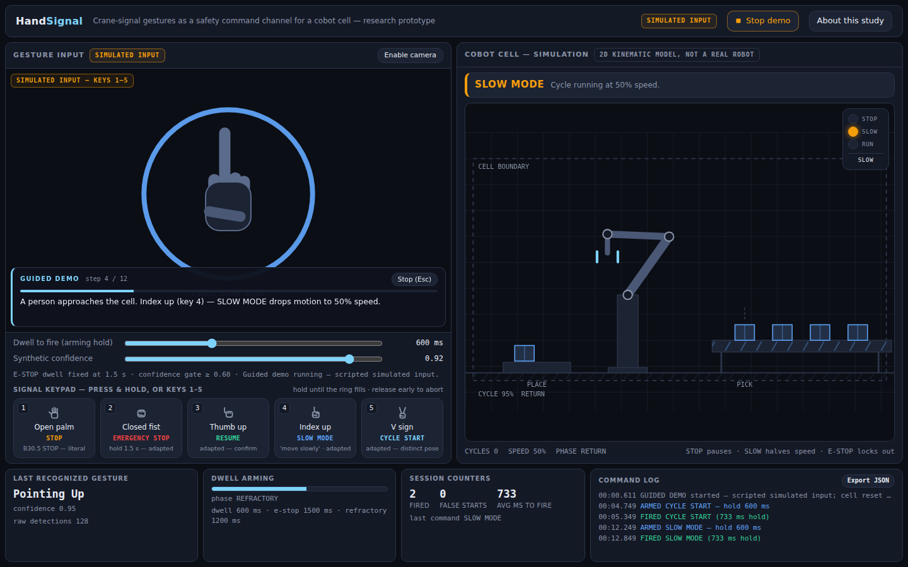
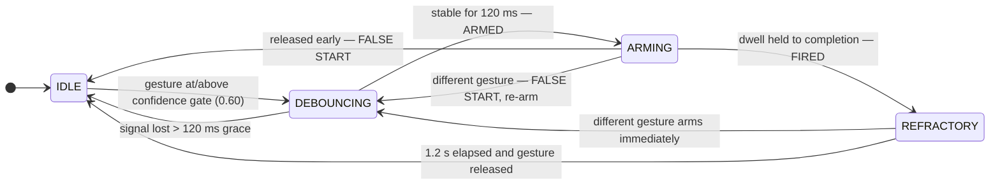
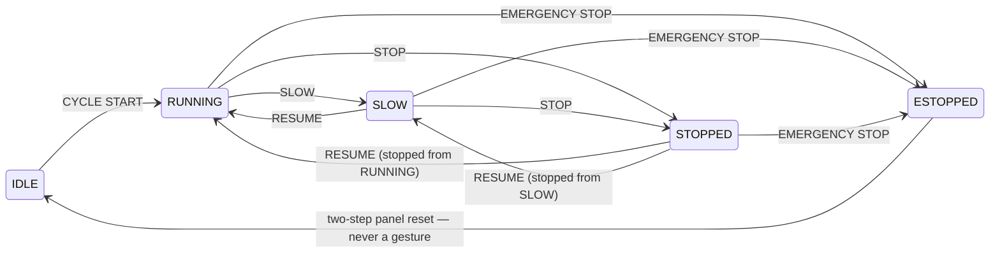
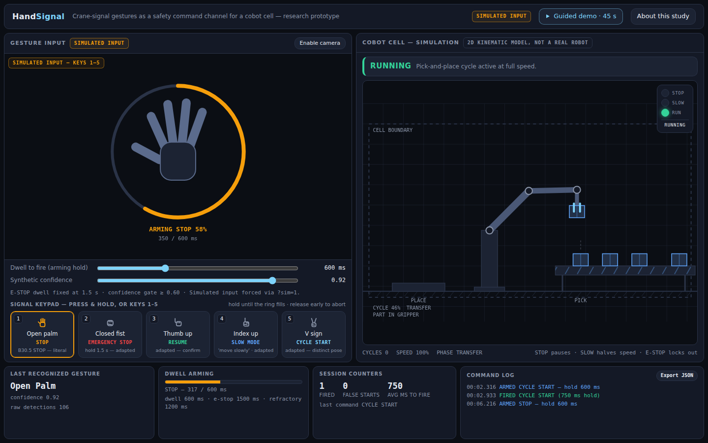
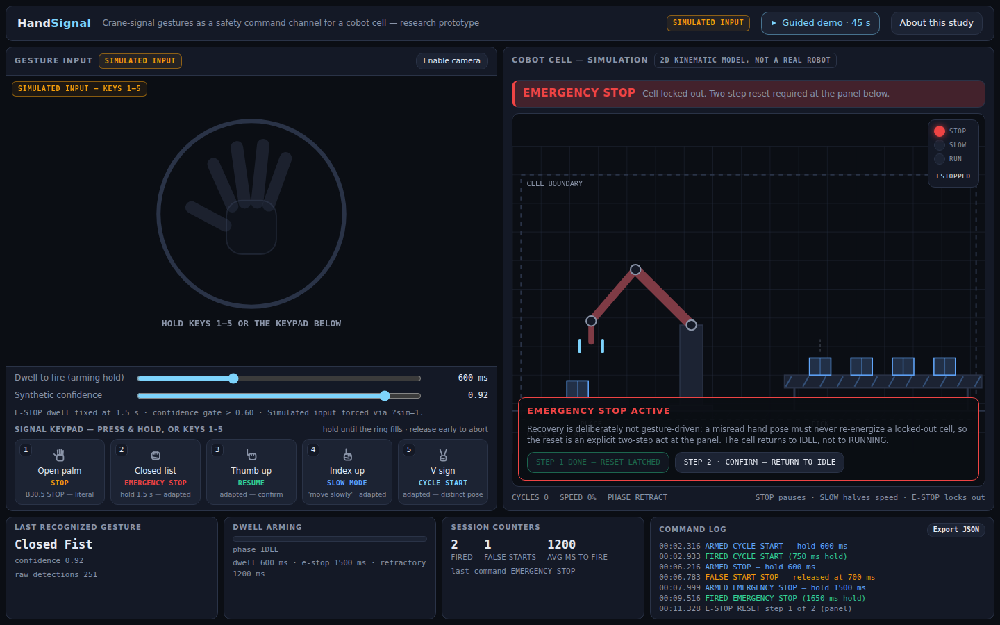

# HandSignal

**Crane hand signals as a safety command channel for a collaborative robot cell.**



On many industrial floors, the two default input channels fail exactly when
they are needed most: hands are busy or gloved, so touchscreens and pendants
are out of reach; the floor runs at 85+ dB and everyone wears hearing
protection, so voice is unreliable. HandSignal explores a third channel — a
small vocabulary of hand signals, recognized by a camera, mapped to a cobot
cell's safety-relevant commands (STOP, EMERGENCY STOP, RESUME, SLOW MODE,
CYCLE START).

The vocabulary is grounded in the **ASME B30.5 crane signalperson signals**: a
real, learned, safety-critical gesture language already in daily use on
industrial floors. Riggers, crane operators, and many general laborers arrive
with pre-existing literacy in it — the open-palm STOP is arguably the most
over-learned safety gesture in industry — so the prototype borrows an existing
signal language rather than inventing one operators must memorize.

Built with Vite + React + TypeScript. Gesture recognition runs on-device via
MediaPipe's GestureRecognizer; a pure-TypeScript safety state machine sits
between recognition and the cell (28 unit tests across the state machine,
cell simulation, and guided-demo script).

## Try it in 60 seconds

```bash
npm install
npm run dev      # then open the printed URL
```

- **No camera needed.** Simulated input is a first-class mode (and the
  default when no camera is present): hold keys **1–5**, or press and hold the
  on-screen signal keypad, to send a gesture through the exact same pipeline
  the camera feeds. Everything simulated is labeled as simulated.
- **Guided demo.** Click **Guided demo · 45 s** (or open `?demo=1`) for a
  scripted, captioned story: cycle start → slow → stop → resume → e-stop →
  two-step reset. Press any gesture key to take over mid-demo.
- **Camera mode** is strictly opt-in: click **Enable camera** to lazy-load
  MediaPipe and drive the cell with your own hand.
- `?sim=1` forces simulated input.

## Gesture vocabulary

| Key | Hand signal (recognized pose) | Crane-signal origin (ASME B30.5) | Adapted meaning in the cell |
| --- | --- | --- | --- |
| 1 | Open palm (`Open_Palm`) | **STOP** — open hand, palm out; the one literal match | **STOP** — pause motion exactly where it is |
| 2 | Closed fist, held 1.5 s (`Closed_Fist`) | Adapted from **"dog everything"** (clasped hands = halt all operations) | **EMERGENCY STOP** — lockout; on-screen two-step reset required |
| 3 | Thumb up (`Thumb_Up`) | Not a B30.5 signal — universal confirm gesture | **RESUME** — return to the state the cell was stopped in |
| 4 | Index finger up (`Pointing_Up`) | Adapted from the **"move slowly"** hand-over-signal modifier | **SLOW MODE** — motion at 50% speed |
| 5 | V sign (`Victory`) | No crane equivalent — chosen as a visually distinct pose | **CYCLE START** — begin a cycle, from IDLE only |

Only the open-palm STOP is a literal borrowing; the other four are labeled
adaptations (in the UI keypad, the About panel, and here). See
[Honest limitations](#honest-limitations) for why.

## Safety interaction design

A recognized pose is never a command by itself. Every classification — real or
simulated — passes through the same pipeline in
`src/gesture/stateMachine.ts`:

```
raw classification → confidence gate → debounce → dwell arming → fire → refractory
```



Design decisions worth defending in a crit:

- **Dwell, not toggling.** A command is a deliberate hold with a filling ring
  (600 ms default, adjustable 300–1200 ms), never a passing pose. The ring is
  also an abort affordance: drop the hand before it closes and nothing fires
  (logged as a false start).
- **Asymmetric costs.** Stopping is cheap (600 ms). EMERGENCY STOP requires a
  fixed 1.5 s hold — a false e-stop halts production, so it must cost more
  intent.
- **Refractory is per-gesture, not global.** A held gesture fires exactly
  once — repeating it requires the gesture to be released AND its refractory
  period to elapse — but a *different* gesture can arm immediately — a STOP
  is never queued behind a RESUME's refractory window.
- **E-stop recovery is not gesture-driven.** Reset is a deliberate two-step
  act on the panel (reset, then confirm) and returns the cell only to IDLE — a
  fresh CYCLE START is required. A misread pose must never re-energize a
  locked-out cell: gestures can only make the cell safer.

The simulated cell itself is a small tested state machine
(`src/cell/cellSim.ts`):





## Research question and measures

> Can a standardized industrial hand-signal vocabulary serve as a reliable,
> learnable command channel for cobot cells, and what dwell time best trades
> false activations against responsiveness?

Every raw detection, armed event, fired command, and false start is
timestamped, shown in the telemetry strip, and exportable as JSON. Those logs
directly yield the dependent measures a dwell-time study needs:

| Measure | From the log |
| --- | --- |
| False-activation rate | Fired commands the participant did not intend (post-task review against task instructions) |
| False-start rate | Armed-but-released-early events per command — dwell set too long, or unstable recognition |
| Dwell-to-fire latency | First raw detection → fire, per gesture and per dwell setting |
| Refractory collisions | Raw detections with no arming during refractory — pacing friction |
| Learnability | Change in false starts and latency across task blocks |

Planned design: within-subjects, dwell at 400 / 600 / 900 ms
(counterbalanced), tasks mixing urgent stops with routine starts; a
signal-detection framing where dwell trades hits against false alarms.

**Status: [Evaluation designed; sessions pending].** No participants have been
run and no findings exist; nothing in the prototype or this document reports
study data. Full study design and rationale live in
[`docs/DESIGN-NOTES.md`](docs/DESIGN-NOTES.md).

## Honest limitations

- **Canonical poses as stand-ins.** The recognizer is MediaPipe's stock
  GestureRecognizer, so the vocabulary is constrained to its canonical static
  single-hand poses. Real B30.5 signals are largely *dynamic* (swinging
  forearms, circular motions) and sometimes two-handed. A production system
  would train recognizers on the actual dynamic signals; the claim under test
  here is the *approach* — borrowing an existing industrial gesture language
  and gating it behind dwell/debounce/refractory — not that these five static
  poses are the B30.5 standard.
- **The cell is a cartoon.** The robot is a 2D kinematic simulation
  (keyframed Cartesian path + 2-link inverse kinematics), labeled as such in
  the UI. No physics, no real robot.
- **Simulated input is labeled.** Keyboard/keypad input injects synthetic
  classifications with an adjustable synthetic confidence; the UI badge reads
  SIMULATED INPUT whenever it is active. Downstream of the classifier, the
  code path is identical for both inputs, so state-machine findings from the
  simulator transfer.
- **Camera privacy.** Camera mode is opt-in. All inference runs on-device in
  the browser; no video or gesture data leaves the machine, and nothing is
  recorded. The MediaPipe runtime and model are fetched from the official CDN
  at the moment you opt in (the only network access the feature has).



## Development

```bash
npm install
npm run dev        # development server
npm test           # vitest — 28 tests: state machine, cell, demo script
npm run build      # type-check + production build
npm run preview    # serve the production build
```

Layout: `src/gesture/` (state machine + vocabulary metadata), `src/cell/`
(cell state machine + arm kinematics), `src/demo/` (guided-demo script, with
tests that replay it against the real pipeline), `src/components/` (panes,
keypad, telemetry, about panel).
